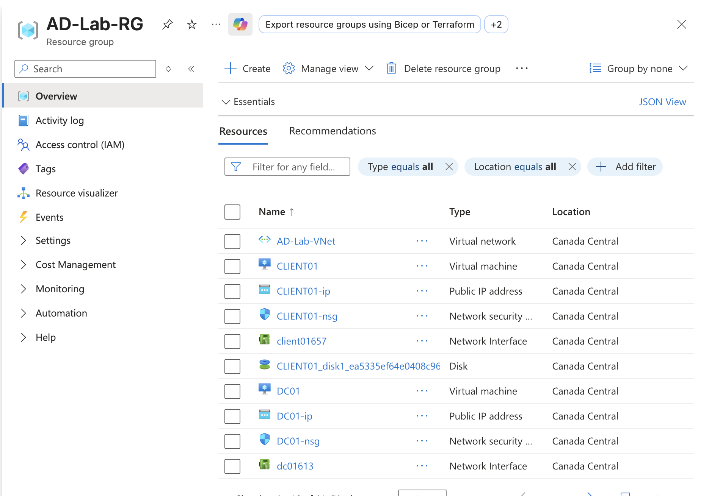
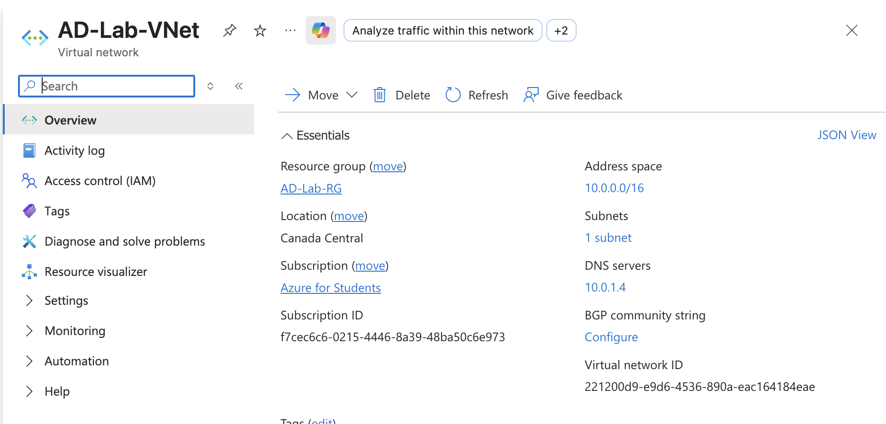

# Active Directory Home Lab — Azure Cloud Environment


Enterprise Active Directory environment built on **Microsoft Azure** simulating a corporate network with a Windows Server 2025 Domain Controller, domain-joined client, 51 users across 4 departments, 5 Group Policies, and 10 real-world helpdesk scenarios with documented SOPs.

Built to demonstrate hands-on IT administration skills including: Active Directory management, Group Policy configuration, user lifecycle management, PowerShell automation, and Tier 1 helpdesk troubleshooting.



---

## Environment

| Component | Details |
|-----------|---------|
| **Cloud Platform** | Microsoft Azure (Student Subscription) |
| **Domain Controller** | DC01 — Windows Server 2025 Datacenter x64 Gen2 |
| **Client Machine** | CLIENT01 — Windows Server 2025 (domain-joined) |
| **Domain** | corp.local (NetBIOS: CORP) |
| **Network** | AD-Lab-VNet — 10.0.0.0/16, AD-Subnet — 10.0.1.0/24 |
| **Region** | Canada Central |
| **VM Size** | Standard B2als_v2 (2 vCPUs, 4 GB RAM) |
| **DNS** | DC01 (10.0.1.4) |

## Architecture
```
┌──────────────────────────────────────────────────────────┐
│                    Microsoft Azure                       │
│                Resource Group: AD-Lab-RG                 │
│                Region: Canada Central                    │
│                                                          │
│   ┌──────────────────────────────────────────────────┐   │
│   │         VNet: AD-Lab-VNet (10.0.0.0/16)          │   │
│   │         Subnet: AD-Subnet (10.0.1.0/24)          │   │
│   │         DNS Server: 10.0.1.4                     │   │
│   │                                                  │   │
│   │   ┌───────────────┐       ┌───────────────┐      │   │
│   │   │     DC01      │       │   CLIENT01    │      │   │
│   │   │  10.0.1.4     │◄─────►│  10.0.1.5     │      │   │
│   │   │               │       │               │      │   │
│   │   │  AD DS + DNS  │       │ Domain-Joined │      │   │
│   │   │  corp.local   │       │ Workstation   │      │   │
│   │   │  5 GPOs       │       │               │      │   │
│   │   │  51 Users     │       │               │      │   │
│   │   └───────────────┘       └───────────────┘      │   │
│   └──────────────────────────────────────────────────┘   │
│                                                          │
│        RDP Access via Microsoft Remote Desktop           │
└──────────────────────────────────────────────────────────┘
```


