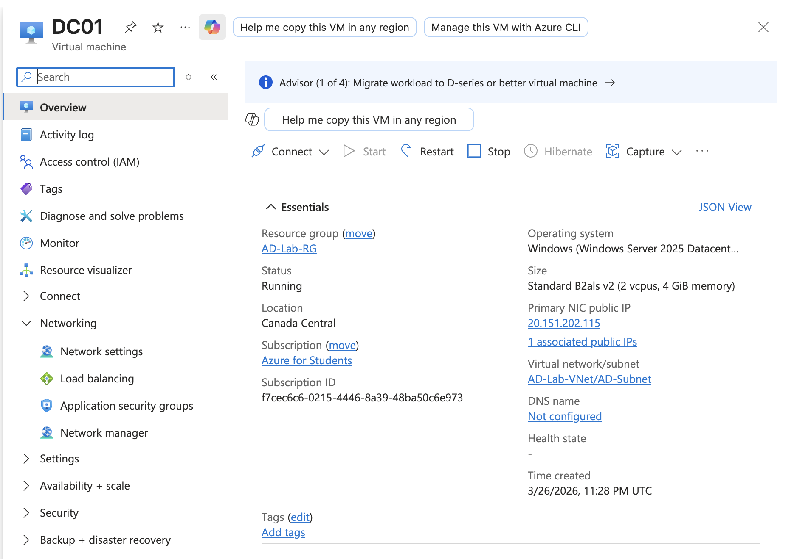
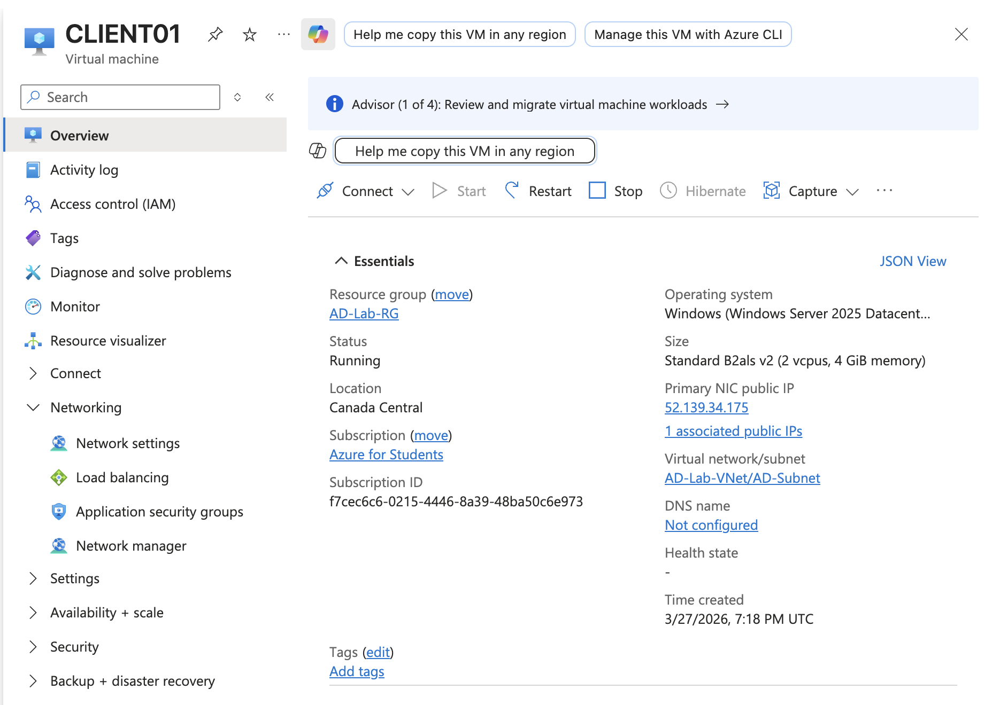
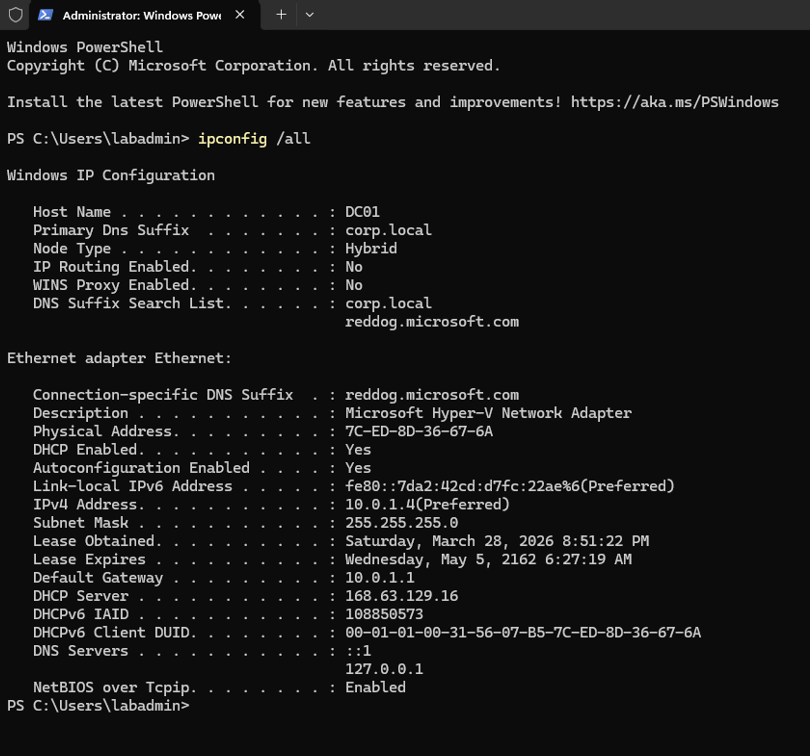
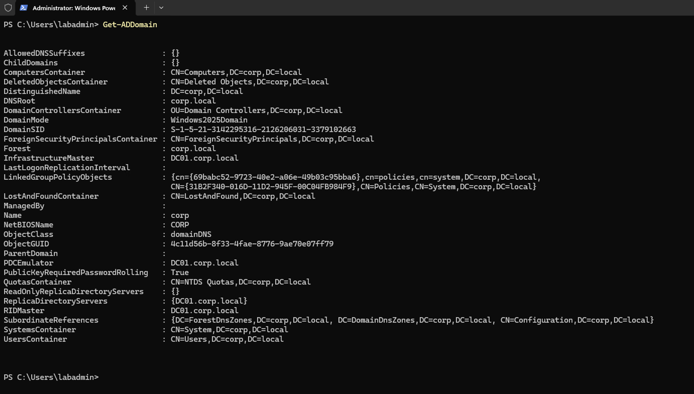
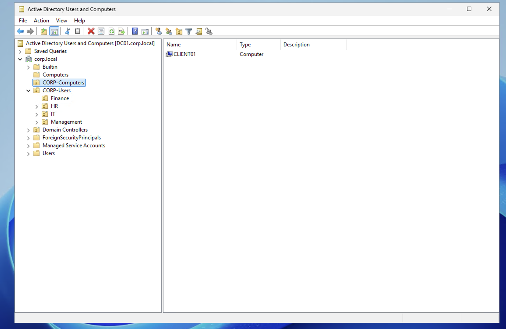
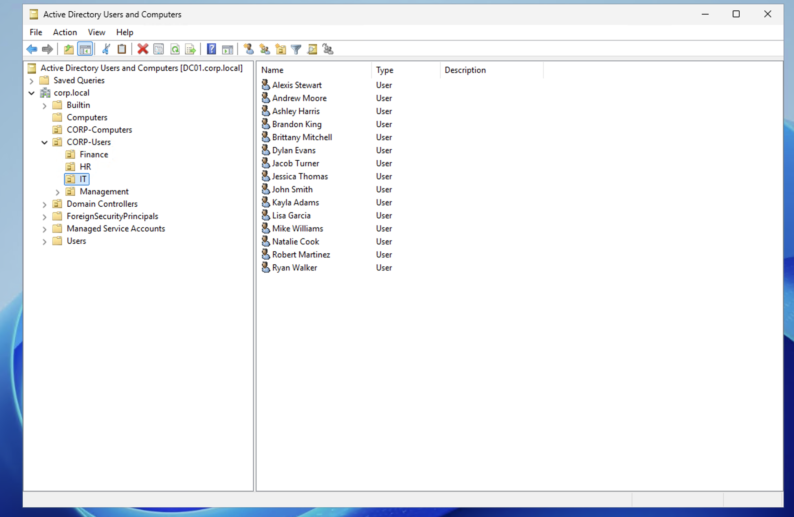
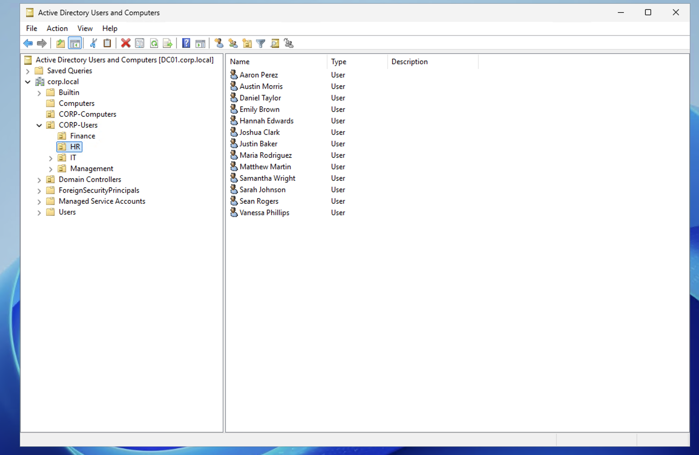
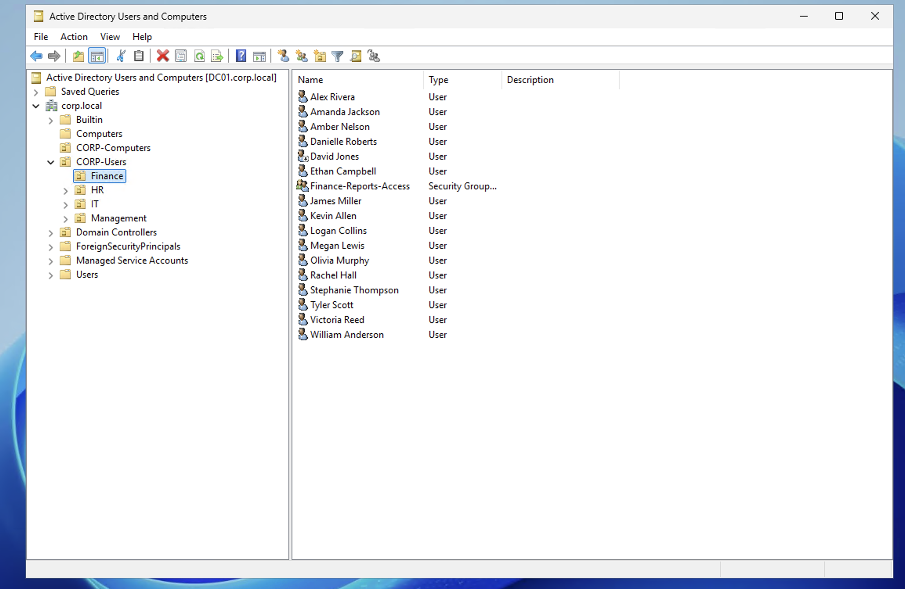
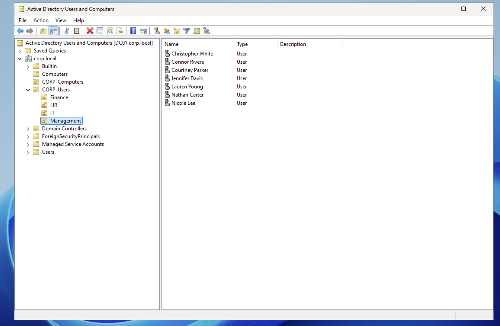
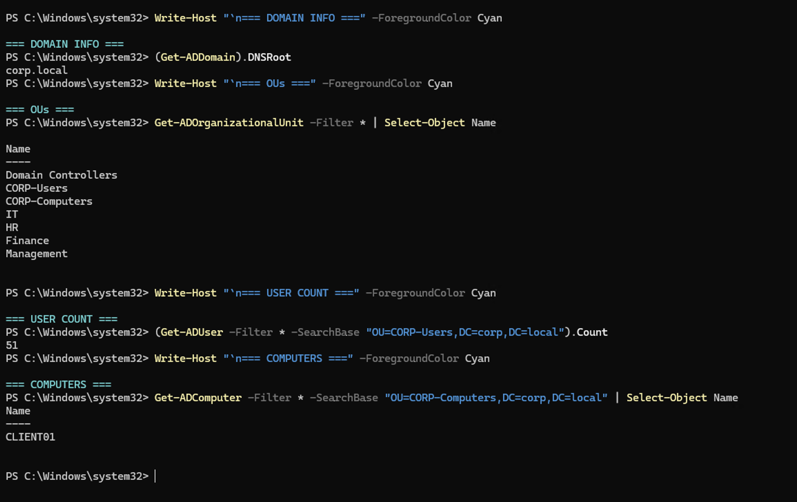

# Active Directory Home Lab — Azure Cloud Environment


Enterprise Active Directory environment built on **Microsoft Azure** simulating a corporate network with a Windows Server 2025 Domain Controller, domain-joined client, 51 users across 4 departments, 5 Group Policies, and 10 real-world helpdesk scenarios with documented SOPs.

Built to demonstrate hands-on IT administration skills including: Active Directory management, Group Policy configuration, user lifecycle management, PowerShell automation, and Tier 1 helpdesk troubleshooting.


---

## Environment

| Component | Details |
|-----------|---------|
| **Cloud Platform** | Microsoft Azure (Student Subscription) |
| **Domain Controller** | DC01 — Windows Server 2025 Datacenter x64 Gen2 |
| **Client Machine** | CLIENT01 — Windows Server 2025 (domain-joined) |
| **Domain** | corp.local (NetBIOS: CORP) |
| **Network** | AD-Lab-VNet — 10.0.0.0/16, AD-Subnet — 10.0.1.0/24 |
| **Region** | Canada Central |
| **VM Size** | Standard B2als_v2 (2 vCPUs, 4 GB RAM) |
| **DNS** | DC01 (10.0.1.4) |

## Architecture
```
┌──────────────────────────────────────────────────────────┐
│                    Microsoft Azure                       │
│                Resource Group: AD-Lab-RG                 │
│                Region: Canada Central                    │
│                                                          │
│   ┌──────────────────────────────────────────────────┐   │
│   │         VNet: AD-Lab-VNet (10.0.0.0/16)          │   │
│   │         Subnet: AD-Subnet (10.0.1.0/24)          │   │
│   │         DNS Server: 10.0.1.4                     │   │
│   │                                                  │   │
│   │   ┌───────────────┐       ┌───────────────┐      │   │
│   │   │     DC01      │       │   CLIENT01    │      │   │
│   │   │  10.0.1.4     │◄─────►│  10.0.1.5     │      │   │
│   │   │               │       │               │      │   │
│   │   │  AD DS + DNS  │       │ Domain-Joined │      │   │
│   │   │  corp.local   │       │ Workstation   │      │   │
│   │   │  5 GPOs       │       │               │      │   │
│   │   │  51 Users     │       │               │      │   │
│   │   └───────────────┘       └───────────────┘      │   │
│   └──────────────────────────────────────────────────┘   │
│                                                          │
│        RDP Access via Microsoft Remote Desktop           │
└──────────────────────────────────────────────────────────┘
```

### Virtual Network Overview


### DC01 — Domain Controller


### CLIENT01 — Domain-Joined Workstation


### DC01 Network Configuration


---

## Active Directory Structure
```
corp.local
├── CORP-Users
│   ├── IT (15 users)
│   ├── HR (14 users)
│   ├── Finance (16 users)
│   └── Management (7 users)
├── CORP-Computers
│   └── CLIENT01
├── Domain Controllers
│   └── DC01
├── Builtin
├── Computers
└── Users
```

51 users created across 4 department OUs — 2 manually via GUI, 48 via PowerShell bulk script, and 1 through the new hire onboarding scenario.

| Department | Users | Example Accounts |
|------------|-------|-----------------|
| **IT** | 15 | jsmith, mwilliams, lgarcia, rmartinez |
| **HR** | 14 | sjohnson, ebrown, mrodriguez, dtaylor |
| **Finance** | 16 | djones, jmiller, wanderson, ajackson, arivera |
| **Management** | 7 | jdavis, cwhite, nlee, lyoung |

### Domain Verification


### OU Tree with CLIENT01


### IT Department (15 users)


### HR Department (14 users)


### Finance Department (16 users)


### Management Department (7 users)


### PowerShell Summary — 51 Users, 7 OUs, CLIENT01


---

## Helpdesk Scenarios

10 real-world Tier 1 helpdesk scenarios simulated and documented with step-by-step resolutions.

| # | Scenario | Method | Description |
|---|----------|--------|-------------|
| 1 | [Password Reset](docs/01-password-reset.md) | GUI | User forgot password — reset with temporary password |
| 2 | [Account Lockout & Unlock](docs/02-account-lockout.md) | GUI | Account locked after 5 failed attempts — find and unlock |
| 3 | [Create New User](docs/03-create-user.md) | GUI | New hire onboarding — create account in correct OU |
| 4 | [Disable/Enable Account](docs/04-disable-enable.md) | GUI | Employee termination and rehire |
| 5 | [Add User to Security Group](docs/05-security-group.md) | GUI | Grant resource access via group membership (RBAC) |
| 6 | [Move User Between Departments](docs/06-move-user.md) | GUI | Employee transfer — move OU and update department |
| 7 | [GPO Troubleshooting](docs/07-gpo-troubleshooting.md) | GUI + CLI | Diagnose policy issues with gpresult |
| 8 | [Find Expiring Accounts](docs/08-expiring-accounts.md) | PowerShell | Report accounts expiring within 60 days |
| 9 | [Bulk Password Reset](docs/09-bulk-password-reset.md) | PowerShell | Emergency security response — reset entire department |
| 10 | [Trust Relationship Fix](docs/10-trust-relationship.md) | PowerShell | Workstation loses domain trust — diagnose and repair |
