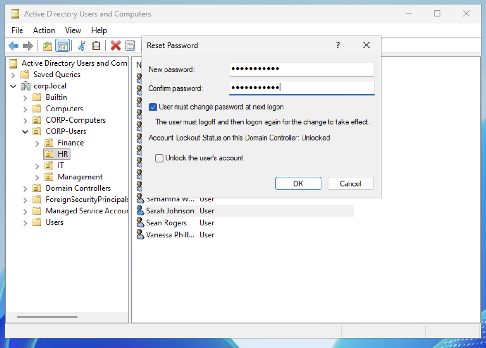
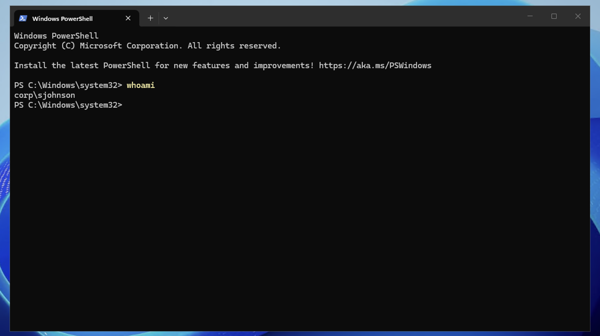

# Scenario 1 — Password Reset

## Ticket
> "Hi helpdesk, this is Sarah Johnson from HR. I forgot my password and can't log in."

## Priority
**Low** — Single user, no security impact

## Resolution (GUI)

1. Open **Active Directory Users and Computers** on DC01
2. Navigate to **corp.local → CORP-Users → HR**
3. Right-click **Sarah Johnson** → **Reset Password**
4. Enter a temporary password (e.g., `TempPass@2026!`)
5. Check **"User must change password at next logon"**
6. Click **OK**

## Verification

Logged into CLIENT01 as `CORP\sjohnson` with the temporary password. User was prompted to change password on first login — confirming the reset was successful.

## Notes

- In a real environment, the helpdesk never sets a permanent password — always use a temporary password with "must change at next logon" so the user creates their own.
- When supporting remote users via RDP, the "must change password at next logon" feature may not work through the RDP client. In that case, reset without the checkbox and instruct the user to change their password manually via Ctrl+Alt+Del → Change Password.
- Always verify the user's identity before resetting — confirm employee ID, manager name, or other verification per company policy.
