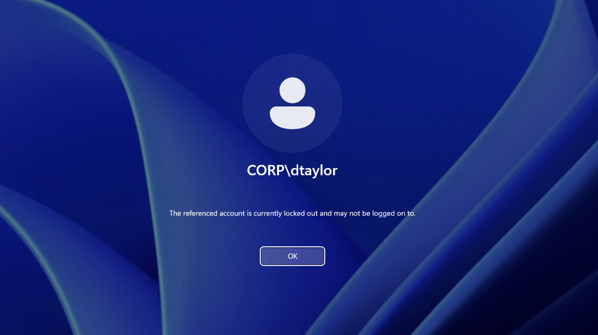
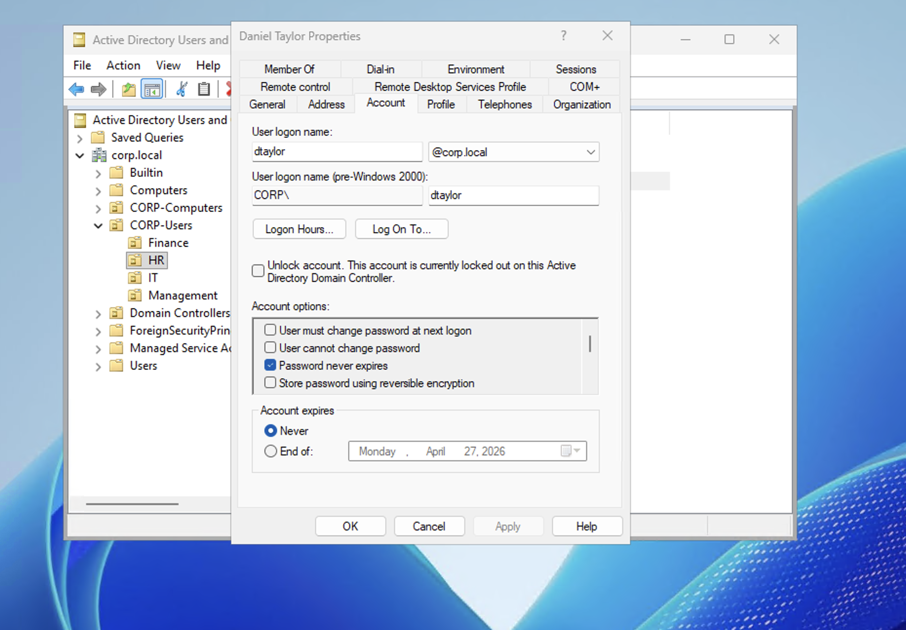
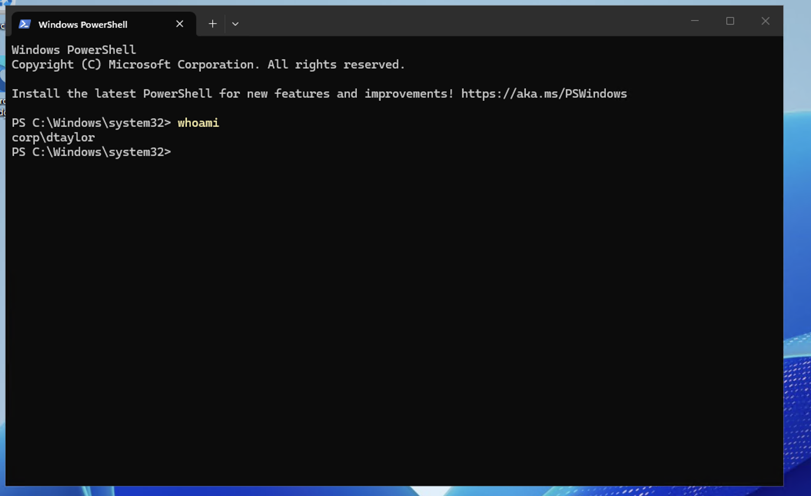

# Scenario 2 — Account Lockout & Unlock

## Ticket
> "I keep trying to log in but it says my account is locked out."

## Priority
**Medium** — User cannot work, potential security concern if repeated

## Cause

The domain's Account Lockout Policy locks accounts after **5 failed login attempts** for **30 minutes**. This prevents brute-force password attacks but also triggers when users mistype their password repeatedly.

## Resolution (GUI)

1. Open **Active Directory Users and Computers** on DC01
2. Navigate to **corp.local → CORP-Users → HR**
3. Double-click **Daniel Taylor** → click the **Account** tab
4. Check the box: **"Unlock account. This account is currently locked out on this Active Directory Domain Controller."**
5. Click **OK**

## Verification

Logged into CLIENT01 as `CORP\dtaylor` with the correct password — login successful after unlock.

## Notes

- Account lockouts are the **#1 most common helpdesk ticket** in most organizations.
- If the same user keeps getting locked out without typing the wrong password, investigate: a cached credential on another device, a mapped drive with old credentials, or a mobile device with a stale email password can all cause repeated lockouts.
- The lockout counter resets after 30 minutes (configured in Group Policy). The user can also wait 30 minutes for the automatic unlock.
- For security awareness: if a user you don't recognize is getting locked out repeatedly, it could indicate a brute-force attack — escalate to the security team.
