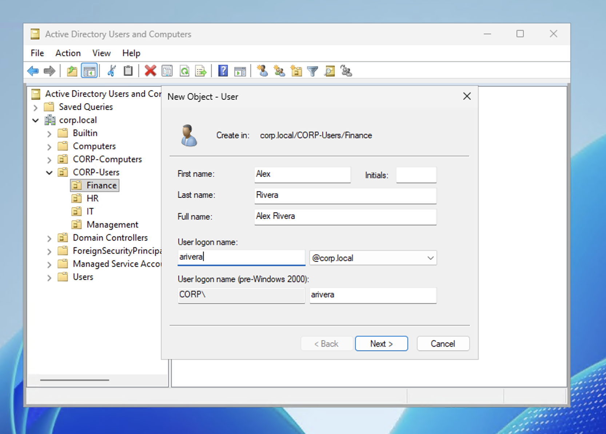
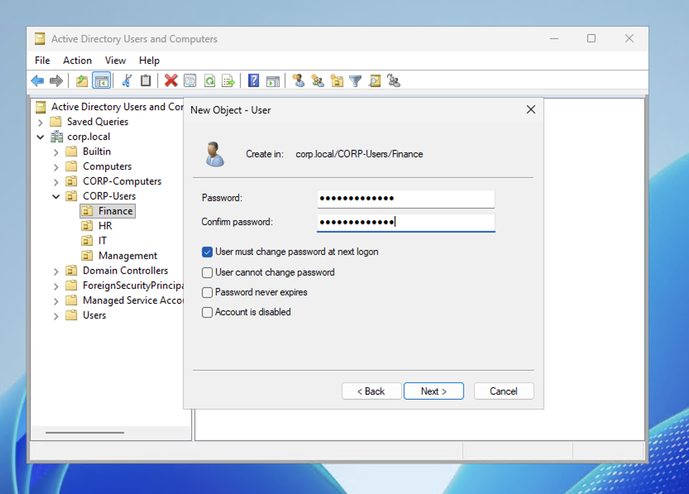
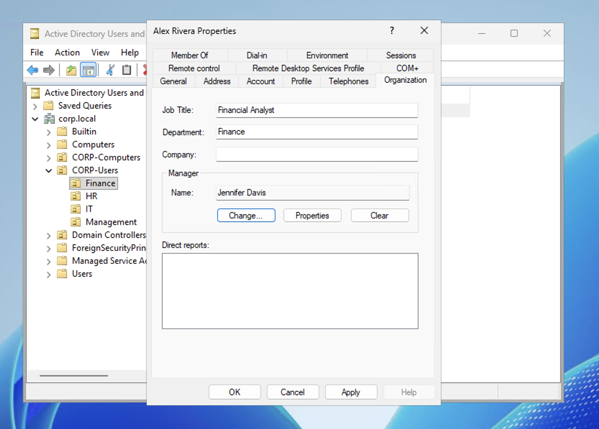
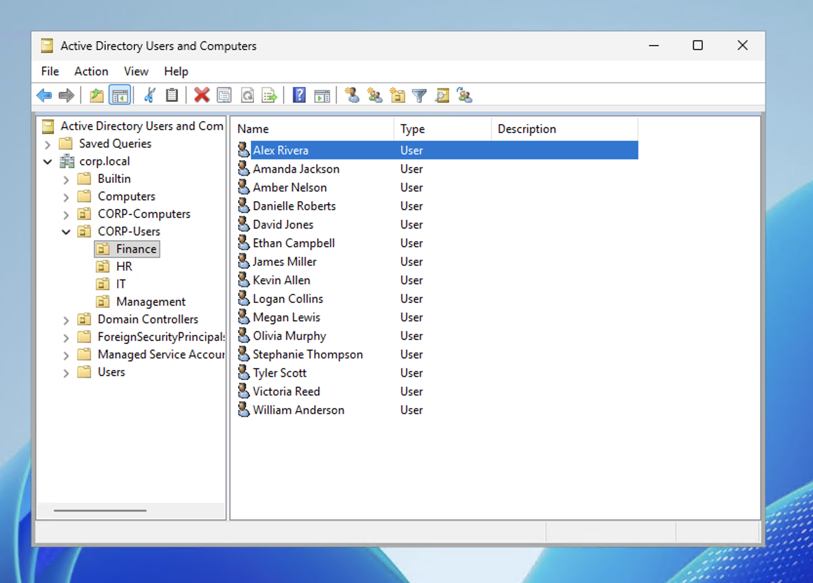

# Scenario 3 — Create New User Account

## Ticket
> "We have a new hire starting Monday in Finance. Name is Alex Rivera. Please create their account."

## Priority
**Medium** — New employee needs access by start date

## Resolution (GUI)

1. Open **Active Directory Users and Computers** on DC01
2. Navigate to **corp.local → CORP-Users → Finance**
3. Right-click **Finance** → **New** → **User**
4. Fill in:
   - First name: **Alex**
   - Last name: **Rivera**
   - User logon name: **arivera**
5. Click **Next**
6. Set temporary password: `NewHire@2026!`
7. Check **"User must change password at next logon"**
8. Click **Next** → **Finish**

9. Double-click **Alex Rivera** → **Organization** tab
10. Department: **Finance**
11. Job Title: **Financial Analyst**
12. Manager: **Jennifer Davis**
13. Click **OK**

## Verification

Confirmed Alex Rivera appears in the Finance OU. Logged into CLIENT01 as `CORP\arivera` — login successful.

## Notes

- Always create users in the **correct department OU** — this ensures the right Group Policies apply from day one.
- Fill in the Organization tab (department, title, manager) — this data is used by the company directory, email address books, and admin reporting.
- Follow the company's username naming convention. In this lab we use first initial + last name (arivera). Other common formats: first.last, first_last.
- In a real environment, you'd also add the user to any department-specific security groups for file share access, application permissions, and distribution lists.
