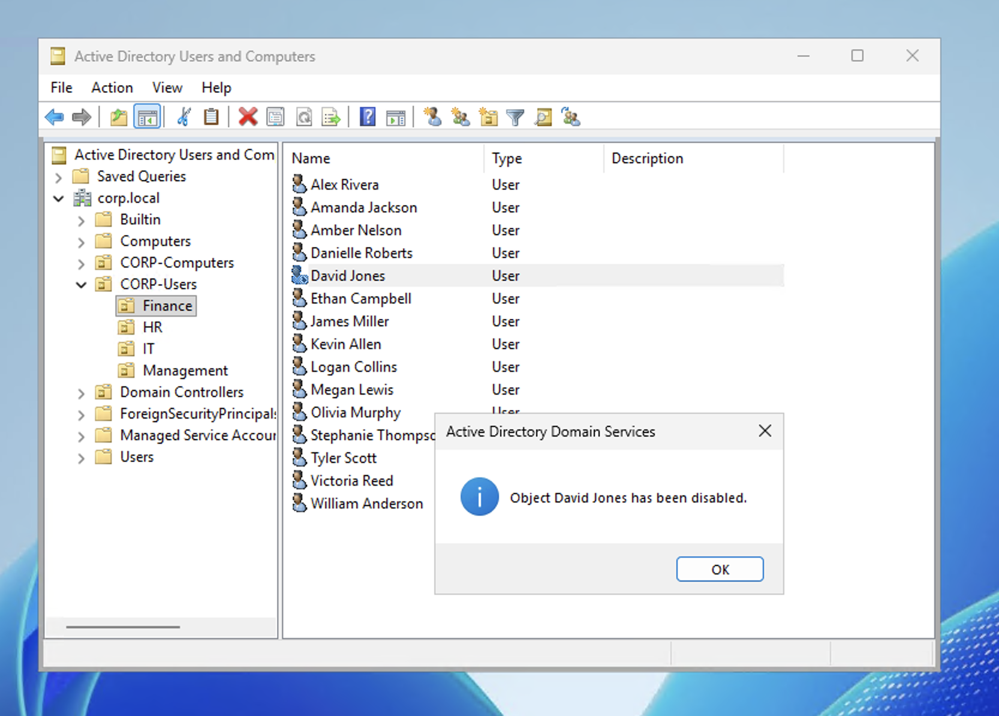
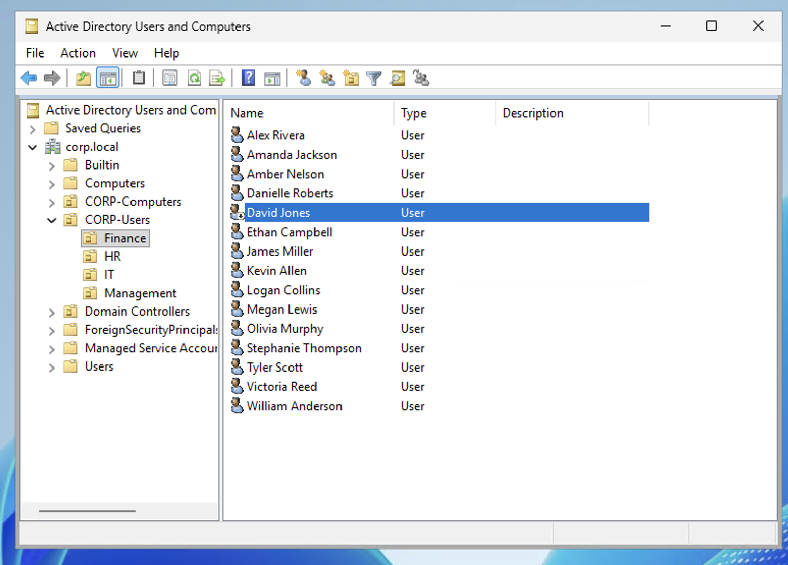

# Scenario 4 — Disable/Enable User Account

## Ticket
> "David Jones in Finance has been terminated effective immediately. Please disable his account."

## Priority
**High** — Security risk, must be actioned immediately upon termination notice

## Resolution — Disable (GUI)

1. Open **Active Directory Users and Computers** on DC01
2. Navigate to **corp.local → CORP-Users → Finance**
3. Right-click **David Jones** → **Disable Account**
4. Click **OK**

The account icon now shows a **red down arrow** indicating the account is disabled.

## Resolution — Re-Enable (GUI)

Two weeks later: *"David Jones has been rehired. Please re-enable his account."*

1. Right-click **David Jones** → **Enable Account**
2. Click **OK**
3. Reset password since the user has been away

## Verification

Attempted login as `CORP\djones` while disabled — access denied. After re-enabling, login successful.

## Notes

- **Disable, never delete** on termination. Deleting an account permanently destroys the Security Identifier (SID). Even if you recreate an account with the same username, it gets a new SID — meaning all previous file permissions, group memberships, and access are permanently lost.
- Disabled accounts should be retained for **30-90 days** per most company policies, for legal holds, audit requirements, or potential rehire.
- In a real environment, the termination process also includes: removing the user from all security groups, forwarding their email to their manager, revoking VPN access, and disabling any cloud accounts (M365, SaaS apps).
- Some companies move disabled accounts to a "Disabled Users" OU for easier management.
