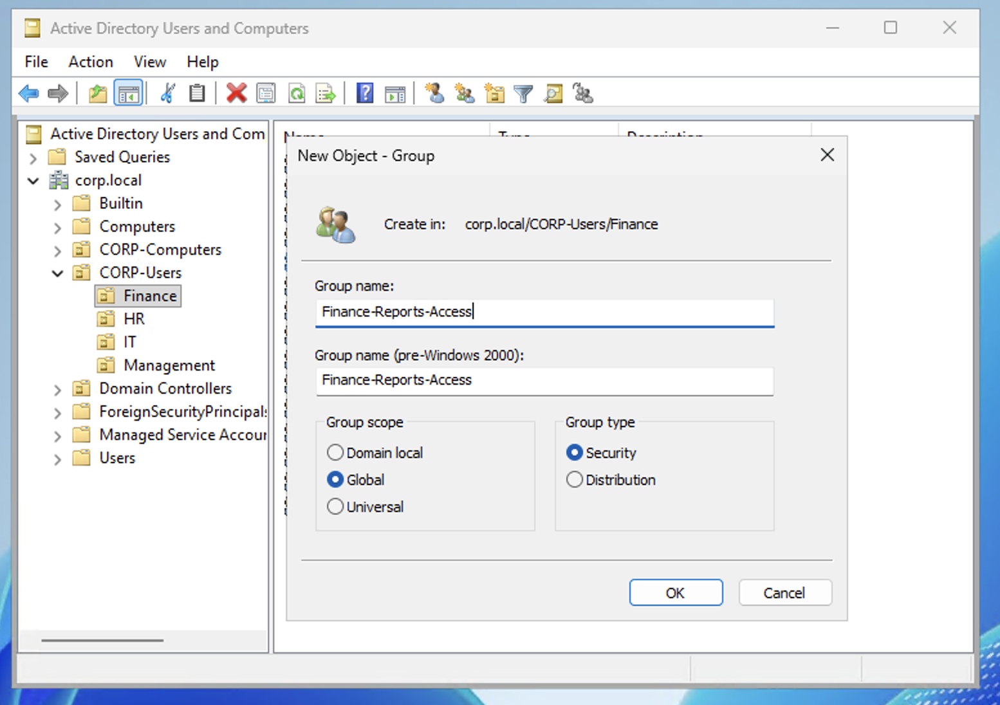
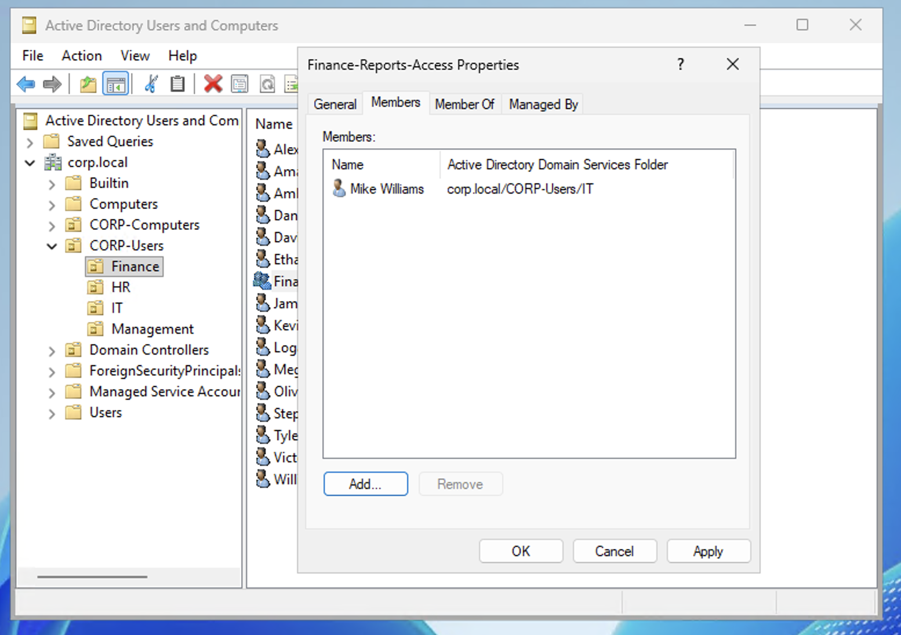
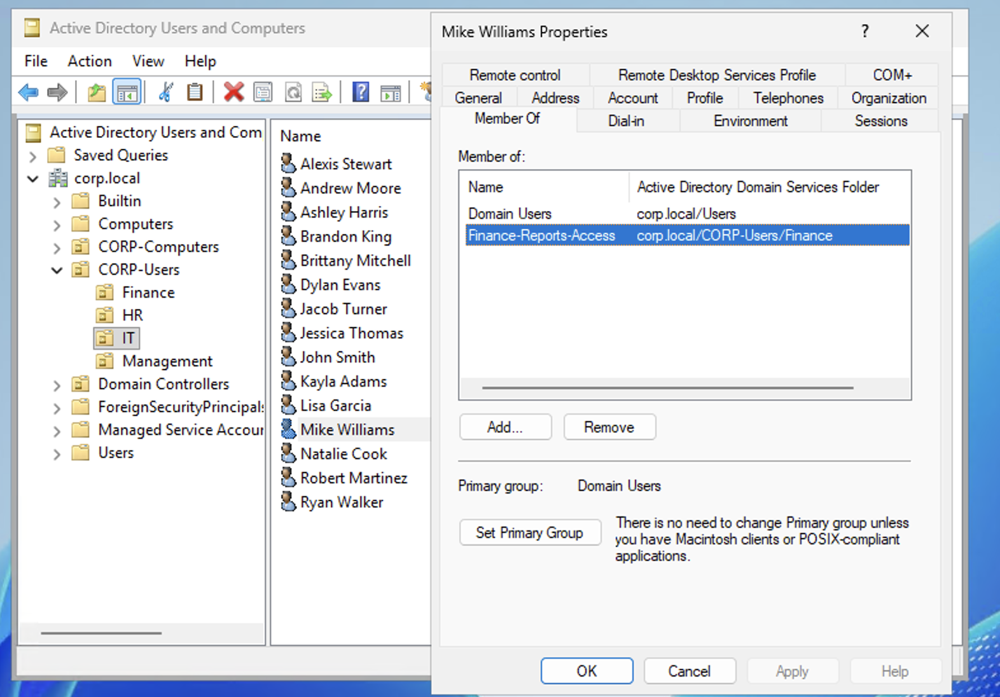

# Scenario 5 — Add User to Security Group

## Ticket
> "Mike Williams in IT needs access to the shared finance reports."

## Priority
**Low** — Access request, no urgency

## Resolution (GUI)

### Step 1 — Create the Security Group

1. Open **Active Directory Users and Computers** on DC01
2. Navigate to **corp.local → CORP-Users → Finance**
3. Right-click **Finance** → **New** → **Group**
4. Group name: **Finance-Reports-Access**
5. Group scope: **Global**
6. Group type: **Security**
7. Click **OK**

### Step 2 — Add User to the Group

8. Double-click **Finance-Reports-Access** → **Members** tab
9. Click **Add** → type **mwilliams** → **Check Names** → **OK**

### Step 3 — Verify from User Side

10. Navigate to **CORP-Users → IT** → double-click **Mike Williams** → **Member Of** tab
11. Confirm **Finance-Reports-Access** is listed

## Notes

- This follows **Role-Based Access Control (RBAC)** — permissions are assigned to groups, not individuals. When Mike no longer needs access, remove him from the group instead of hunting down individual permissions.
- **Global** scope means the group can contain members from the same domain and can be used to assign permissions in any domain in the forest.
- **Security** type (vs Distribution) means this group can be used to assign NTFS permissions, share access, and other security-related permissions. Distribution groups are only for email lists.
- In a real environment, the security group would be assigned permissions on a file share or SharePoint site. Adding Mike to the group automatically grants him access.
