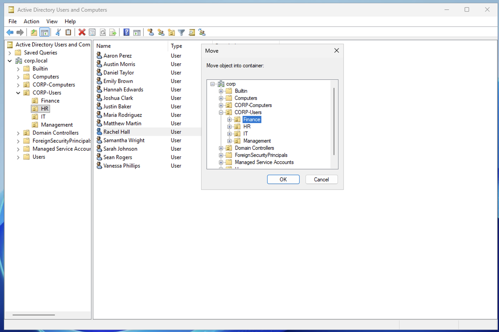
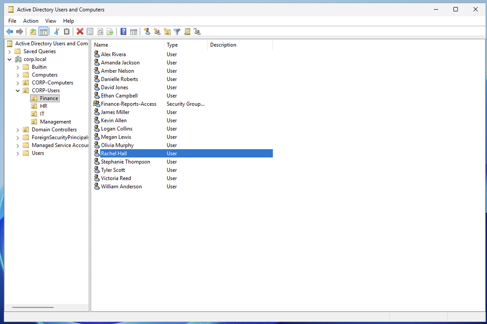
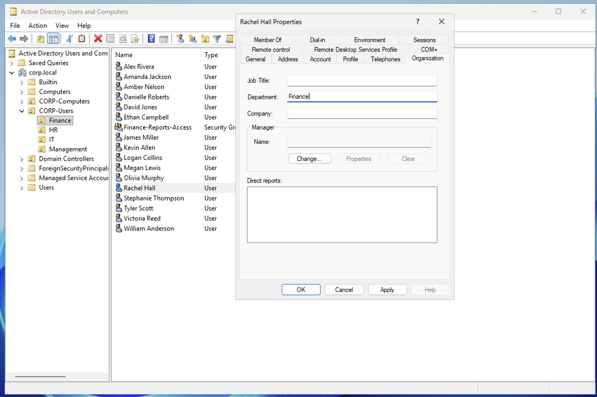

# Scenario 6 — Move User Between Departments

## Ticket
> "Rachel Hall is transferring from HR to Finance effective today. Please update her account."

## Priority
**Medium** — Employee needs correct access and policies for new role

## Resolution (GUI)

### Step 1 — Move the Account to the New OU

1. Open **Active Directory Users and Computers** on DC01
2. Navigate to **corp.local → CORP-Users → HR**
3. Right-click **Rachel Hall** → **Move**
4. Select **Finance** OU → **OK**

### Step 2 — Update the Department Field

5. Navigate to **Finance** OU → double-click **Rachel Hall**
6. Click the **Organization** tab
7. Change Department from **HR** to **Finance**
8. Click **OK**

## Why Both Steps?

- **Moving the OU** changes which Group Policies apply. If Rachel stays in the HR OU, she keeps getting HR policies even though she transferred.
- **Updating the Department field** is a separate text attribute on the account. AD doesn't automatically update it when you move someone. Other admins, scripts, and reports use this field to identify which department a user belongs to.

These are two independent actions — forgetting one is a common mistake in real environments.

## Notes

- In a real environment, a department transfer also involves: updating security group memberships (remove HR groups, add Finance groups), changing manager, updating job title, and potentially modifying email distribution lists.
- Run `gpupdate /force` on the user's workstation after the move to immediately apply the new department's policies.
