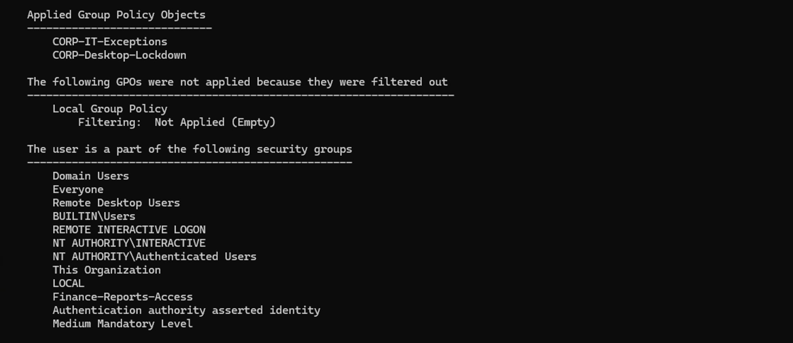
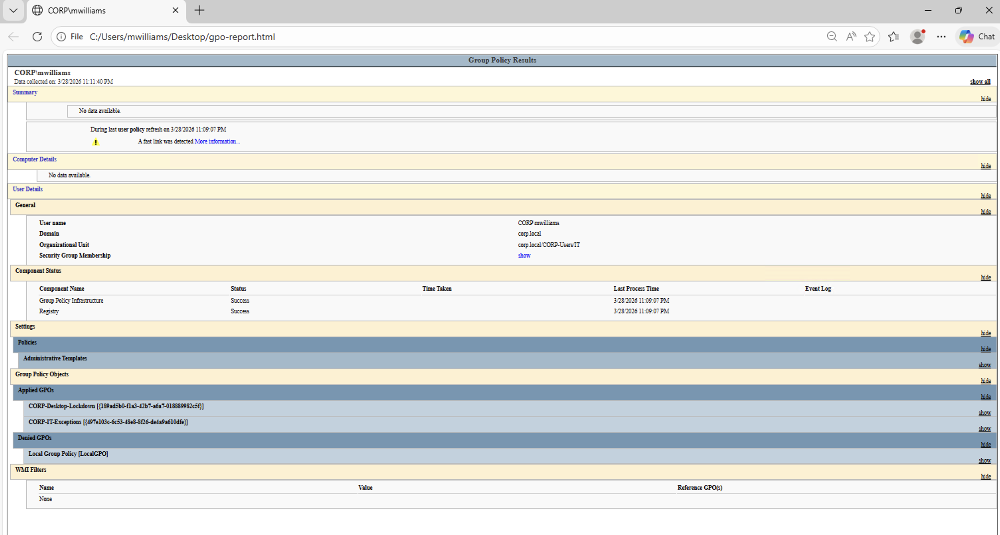
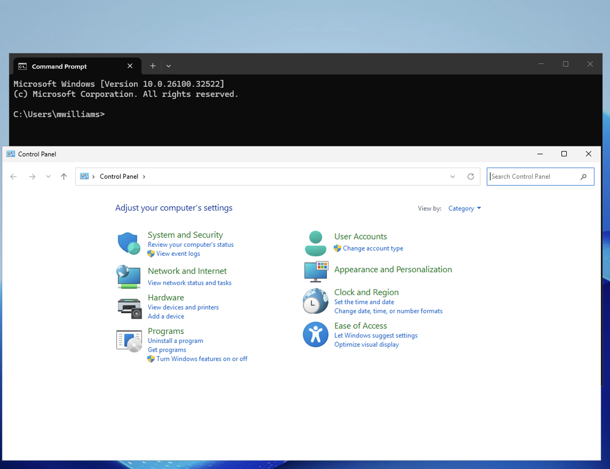
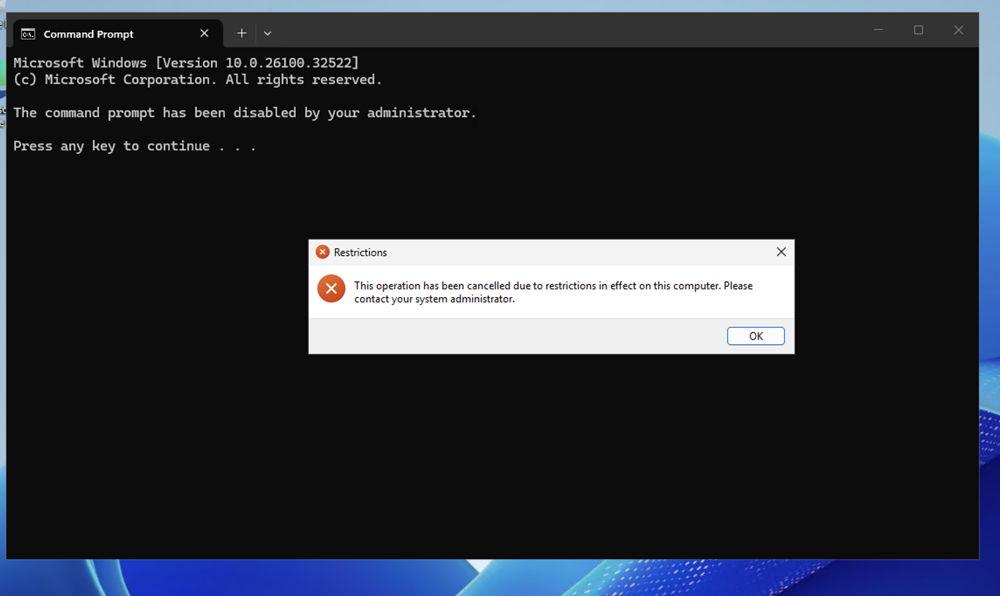

# Scenario 7 — GPO Troubleshooting

## Ticket
> "I'm in the IT department but I can't open Control Panel. The policy seems wrong."

## Priority
**Medium** — User's tools are restricted, impacting productivity

## Resolution

### Step 1 — Check Applied Policies

1. Log into CLIENT01 as `CORP\mwilliams` (IT user)
2. Open **PowerShell** and run:
```powershell
gpresult /r
```

3. Scroll to **Applied Group Policy Objects** under USER SETTINGS
4. Verify both **CORP-Desktop-Lockdown** and **CORP-IT-Exceptions** are listed



### Step 2 — Generate HTML Report
```powershell
gpresult /h C:\Users\mwilliams\Desktop\gpo-report.html
```


Open the HTML file on the desktop for a detailed visual breakdown of all applied policies.

### Step 3 — Verify IT vs HR Access

**IT user (mwilliams):** Control Panel and Command Prompt both open successfully.



**HR user (dtaylor):** Control Panel is blocked by the Desktop Lockdown policy.



Same computer, different users, different policies — GPO inheritance working correctly.

## Troubleshooting Steps If a Policy Isn't Applying

1. **Force a policy refresh:** `gpupdate /force`
2. **Check the GPO link:** In Group Policy Management on DC01, verify the GPO is linked to the correct OU
3. **Check GPO status:** Make sure the GPO is not disabled (Link Enabled = Yes)
4. **Check security filtering:** The GPO must apply to the user or a group they belong to (default is Authenticated Users)
5. **Check inheritance:** A parent OU's GPO can be blocked if "Block Inheritance" is set on the child OU

## Notes

- `gpresult /r` is your first troubleshooting command for any GPO issue — memorize it.
- The HTML report (`gpresult /h`) is useful for sending to senior admins or documenting issues in a ticket.
- In this lab, the IT-Exceptions GPO explicitly sets restrictions to **Disabled** (not "Not Configured") — this is critical because "Not Configured" would let the parent lockdown policy still apply.
