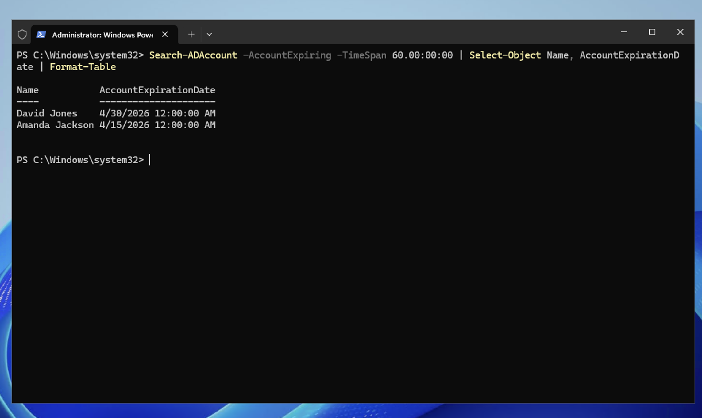
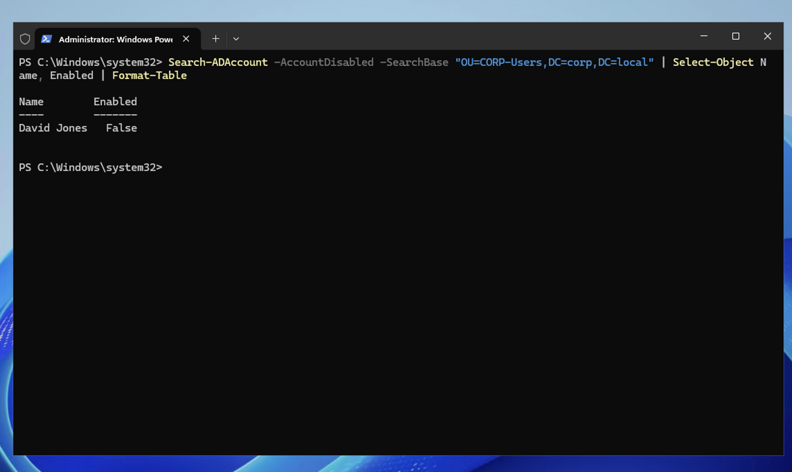

# Scenario 8 — Find Expiring Accounts

## Ticket
> "Management wants a report of all accounts expiring in the next 60 days."

## Priority
**Low** — Reporting request, no immediate action needed

## Resolution (PowerShell)

On DC01, open PowerShell (Admin):

### Find Accounts Expiring Within 60 Days
```powershell
Search-ADAccount -AccountExpiring -TimeSpan 60.00:00:00 | Select-Object Name, AccountExpirationDate | Format-Table
```



### Find All Disabled Accounts
```powershell
Search-ADAccount -AccountDisabled -SearchBase "OU=CORP-Users,DC=corp,DC=local" | Select-Object Name, Enabled | Format-Table
```



## Notes

- `Search-ADAccount` is the go-to command for finding locked, disabled, expired, or expiring accounts.
- In a real environment, these reports would be scheduled as automated tasks using Task Scheduler and emailed to management weekly.
- Expiring accounts are common for contractors, interns, and temporary employees who are given a set end date when their account is created.
- Proactively identifying expiring accounts prevents helpdesk tickets on the expiration day — you can reach out to the manager in advance to ask if the account should be extended or allowed to expire.
