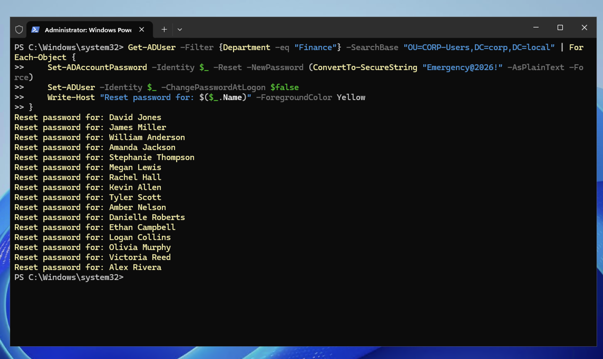
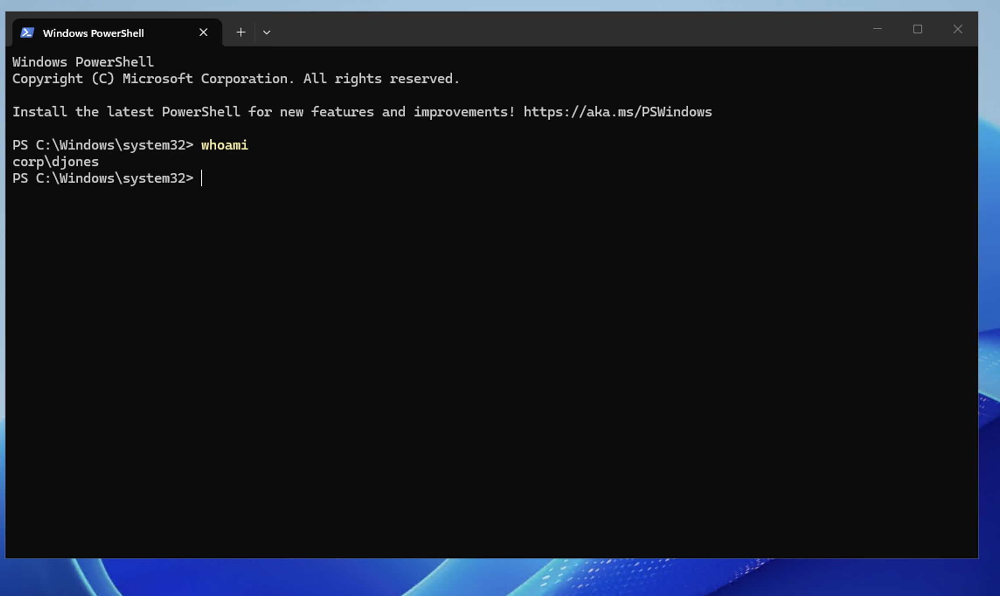

# Scenario 9 — Bulk Password Reset

## Ticket
> "URGENT: We've detected a possible security breach. Reset all Finance department passwords immediately."

## Priority
**Critical** — Security incident, immediate action required

## Resolution (PowerShell)

On DC01, open PowerShell (Admin):
```powershell
Get-ADUser -Filter {Department -eq "Finance"} -SearchBase "OU=CORP-Users,DC=corp,DC=local" | ForEach-Object {
    Set-ADAccountPassword -Identity $_ -Reset -NewPassword (ConvertTo-SecureString "**********" -AsPlainText -Force)
    Set-ADUser -Identity $_ -ChangePasswordAtLogon $true
    Write-Host "Reset password for: $($_.Name)" -ForegroundColor Yellow
}
```

All 16 Finance users reset in under 5 seconds.



## Verification

Logged into CLIENT01 as `CORP\djones` with Temp Password — login successful, confirming the bulk reset worked.



## Why PowerShell Over GUI?

Resetting 16 accounts manually through the GUI would take approximately 15 minutes — right-click, reset, type password, confirm, repeat. With PowerShell, the same task takes one command and 5 seconds. During a security incident, every minute counts.

## Notes

- This is **incident response in action** — a core cybersecurity skill. Speed matters when credentials may be compromised.
- The `-ChangePasswordAtLogon $true` flag forces each user to create their own new password at next login. The emergency password is temporary.
- In a real breach scenario, you'd also: notify affected users, check audit logs for unauthorized access, escalate to the security team, and document the incident.
- After the immediate response, investigate the root cause — was it phishing, credential stuffing, or an insider threat?
