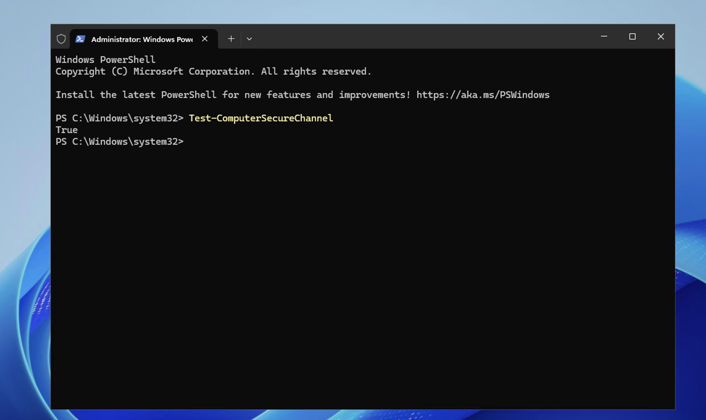
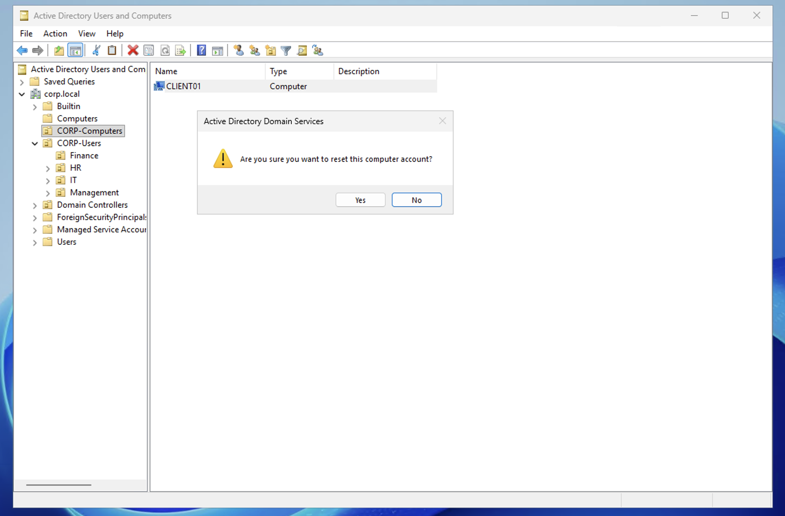
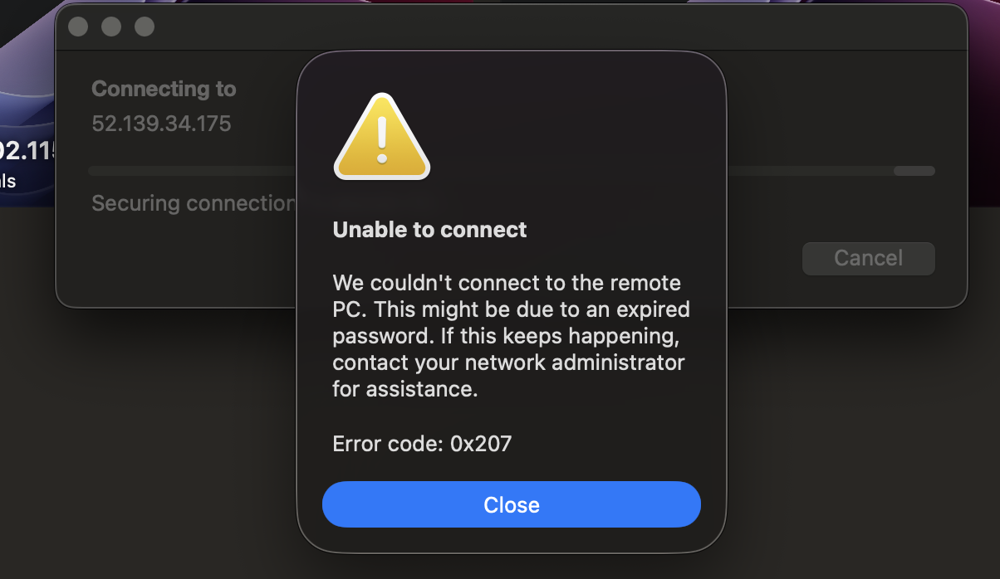
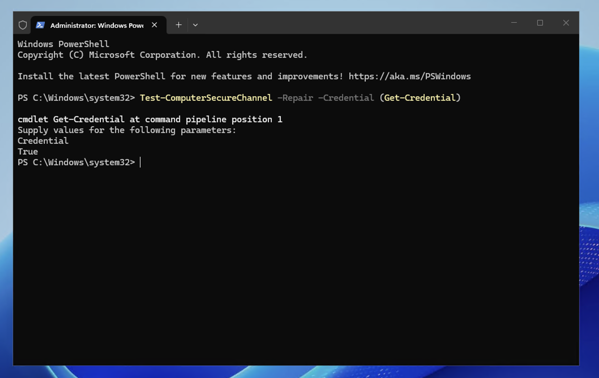
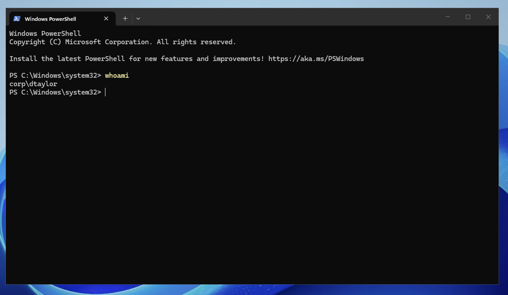

# Scenario 10 — Trust Relationship Fix

## Ticket
> "When I try to log in it says the trust relationship between this workstation and the primary domain failed."

## Priority
**High** — User completely unable to log in with any domain account

## Cause

Every domain-joined computer has a hidden machine account password that it uses to authenticate with the Domain Controller. This password rotates every 30 days automatically. If the password gets out of sync between the computer and AD (due to a restore from backup, VM snapshot rollback, or extended offline period), the computer can no longer prove its identity to the DC — resulting in the trust relationship error.

## Resolution

### Step 0 — Confirm Trust is Healthy (Before)

Before the incident, the trust was verified as healthy using `Test-ComputerSecureChannel` which returned **True**.



### Step 1 — Simulate the Break

On DC01, reset the computer account to create a password mismatch: Active Directory Users and Computers → CORP-Computers → right-click CLIENT01 → Reset Account.



After restarting CLIENT01, attempting to log in with a domain account fails with the trust relationship error.



### Step 2 — Log in with a Local Account

Log into CLIENT01 as **.\localadmin** (the dot tells Windows to use the local account, not the domain).

### Step 3 — Repair the Trust

Open PowerShell (Admin) and run:
```powershell
Test-ComputerSecureChannel -Repair -Credential (Get-Credential)
```

Enter **CORP\labadmin** credentials when prompted. The command returns **True** if the repair was successful.



### Step 4 — Verify the Fix

Log out and log back in as a domain user — `CORP\dtaylor` with the correct password.



## Alternative Fix — Rejoin the Domain

If `Test-ComputerSecureChannel -Repair` doesn't work, the nuclear option is to unjoin and rejoin:
```powershell
# Remove from domain (restarts the computer)
Remove-Computer -UnjoinDomainCredential (Get-Credential) -Restart

# After restart, rejoin
Add-Computer -DomainName "corp.local" -Credential (Get-Credential) -Restart
```

**Warning:** Rejoining creates a new computer object in AD. You'll need to move it back to the correct OU and reapply any computer-specific policies.

## Notes

- This is one of the **most common and frustrating helpdesk issues** — knowing the fix instantly marks you as experienced.
- `Test-ComputerSecureChannel` is the preferred fix because it repairs the trust without removing the computer from the domain — all group memberships and policies are preserved.
- Common causes in the real world: restoring a VM from an old snapshot, a computer being offline for more than 30 days, or clock skew between the client and DC.
- The `.\` prefix when logging in (e.g., `.\localadmin`) is critical — it tells Windows to authenticate against the local account database instead of the domain. Without it, the login will fail because the domain trust is broken.
